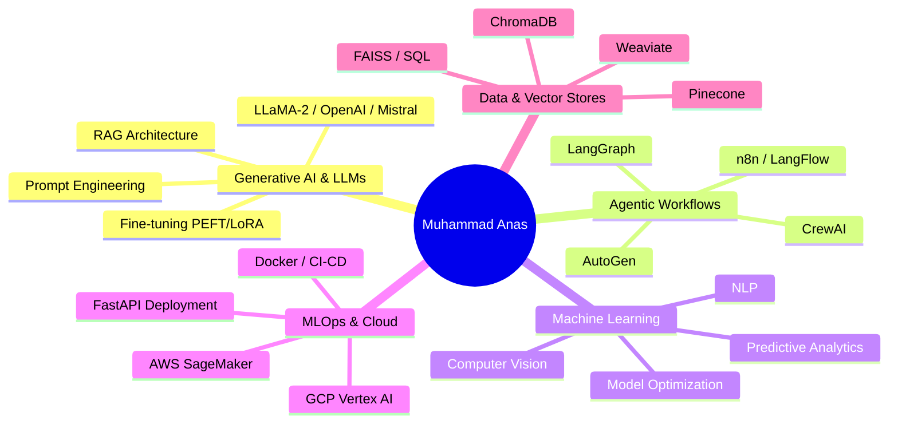

  
  
  
  
  
   
  
  <!-- Animated Welcome Badge -->
  

---

  
  
  
  

  
  
  

---

##  **About Me**

  

 

I'm a **Generative AI Engineer** with a Bachelor's degree in Artificial Intelligence 🎓 from **The Islamia University of Bahawalpur**. I specialize in building high-performance AI solutions, from fine-tuning large language models to developing autonomous agentic systems that automate complex workflows.

>  **Independent Consultant** with experience designing and deploying scalable AI products for international clients across the **USA and Austria** 🇺🇸 🇦🇹

I don't just build models; I build **solutions** that optimize operations, enhance customer experiences, and drive innovation in fast-paced startup environments.

---

##  **Core Competencies**

---

## 🛠️ **Tech Stack**

### **Languages**

### **AI/ML Frameworks**

### **Cloud & DevOps**

### **Vector Databases**

### **Automation Tools**

---

## 🚀 **Featured Projects**

  

 

### 🤖 **Generative AI & LLM Applications**

<table>
  <tr>
    <td width="50%">
      <h3>🔬 ICD & CPT Predictor</h3>
      
<strong>OpenAI · LangChain · RAG</strong>

      
AI tool for accurately mapping raw medical notes to standardized billing diagnoses and procedures with <b>15% improved retrieval quality</b>.

      
      
    </td>
    <td width="50%">
      <h3>🏥 Medical Chatbot with Memory</h3>
      
<strong>LLaMA-2 · RAG · LangChain · Pinecone</strong>

      
AI assistant for answering clinical queries using advanced RAG and vector search for precise, contextual answers.

      
      
    </td>
  </tr>
  <tr>
    <td width="50%">
      <h3>📚 Document Q&A System</h3>
      
<strong>Hugging Face · OpenAI · LangChain</strong>

      
Upload documents and get detailed answers to your questions from within the text using semantic search.

      
      
    </td>
    <td width="50%">
      <h3>📝 Text Summarization Tool</h3>
      
<strong>GPT · NLP · Hugging Face</strong>

      
Condenses lengthy documents into concise, key-point summaries while maintaining crucial information.

      
      
    </td>
  </tr>
</table>

### 👁️ **Computer Vision Projects**

<table>
  <tr>
    <td width="50%">
      <h3>🎥 Object Detection from Images & Video</h3>
      
<strong>TensorFlow · OpenCV · Python</strong>

      
Real-time object detection models for applications in security and automation.

      
    </td>
    <td width="50%">
      <h3>🖼️ Image Captioning</h3>
      
<strong>Hugging Face · TensorFlow</strong>

      
AI model that generates descriptive captions for images, aiding accessibility and enhancing user interaction.

      
    </td>
  </tr>
</table>

### 🛠️ **ML & Other Utilities**

<table>
  <tr>
    <td width="33%">
      <h3>🎤 AI Voice Cloning & TTS</h3>
      
<strong>Speech Synthesis · Deep Learning</strong>

      
System that clones a user's voice and generates realistic speech from text scripts.

      
    </td>
    <td width="33%">
      <h3>📊 Sentiment Analysis with Excel</h3>
      
<strong>Python · Pandas · NLP</strong>

      
Extract and analyze sentiment from Excel datasets for business insights.

      
    </td>
    <td width="33%">
      <h3>🌐 Multi-Language Translator</h3>
      
<strong>Hugging Face · OpenAI</strong>

      
AI-driven translator for seamless cross-language communication.

      
    </td>
  </tr>
</table>

  <h3>✨ Check out more of my models and demos on <a href="https://huggingface.co/muhammadanasakhtar"><b>Hugging Face Spaces</b></a>! ✨</h3>

---

## 📊 **GitHub Analytics**

  
  
   
  
  
  
   
  
  

---

## 🎓 **Education & Certifications**

  
### **Bachelor of Science in Artificial Intelligence**
**The Islamia University of Bahawalpur, Pakistan** (2020 - 2024)

 

### **📜 Certifications**

| Certification | Platform |
|:-------------:|:--------:|
| Generative AI with Large Language Models | DeepLearning.AI |
| LangChain for LLMs | Coursera |
| Generative AI Engineering and Fine-Tuning Transformers | iNeuron |
| Foundational GenAI | iNeuron |
| IBM Generative AI | IBM |
| Generative AI: Introduction and Applications | Multiple |

---

## 📫 **Let's Connect!**

  
  
  
    
  
  
  
  
  
  
    
  
  <table>
    <tr>
      <td align="center">
        <b>📧 Email</b> 
        muhammadanasakhtar19@gmail.com
      </td>
      <td align="center">
        <b>🌐 Location</b> 
        Multan, Pakistan
      </td>
      <td align="center">
        <b>💼 Open for</b> 
        Remote · Relocation · Visa Sponsorship
      </td>
    </tr>
  </table>
  
   
  
  
  
   
  
  ### ⭐ From [Muhammad Anas Akhtar](https://github.com/muhammadanasakhtar) ⭐
  

